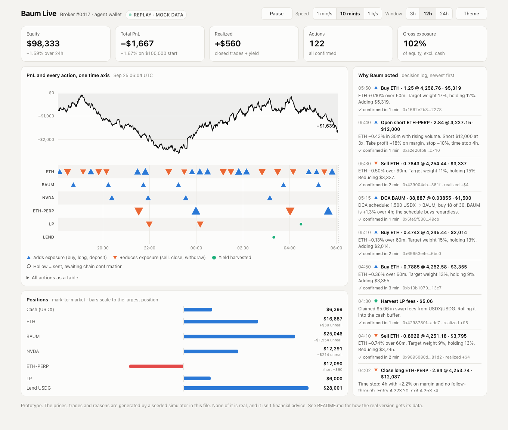

# Baum Live: a real-time view of an agent trading

A prototype of a live dashboard for watching a Baum agent trade a Broker wallet. It shows a timeline of every action, positions that resize as trades land, PnL marked to market, and the reason Baum gave for each move.

The prompt was [Kyle Samani's question](https://x.com/KyleSamani/status/2103336166158188570): *"Has anyone built any really good real-time live visualizations of an agent trading? … You can see some sort of timeline, position sizes, PNLs, those kinds of things in some sort of beautiful moving system."* Baum is well placed to answer it. It already trades (chat swaps on Solana and Robinhood Chain), it has run the USDX vault for six months, and it goes out to 3,888 Broker wallets when the beta opens around Oct 1.



## Run it

It's one HTML file with no build step and no dependencies:

```sh
open index.html          # macOS
# or serve it
python3 -m http.server 8000   # then http://localhost:8000
```

`?theme=light` or `?theme=dark` forces a theme; otherwise the page follows the OS setting. Space pauses and resumes.

**All data in the prototype is mock data.** A seeded simulator in the page generates the prices, actions and reasons, and the page renders them. Nothing touches a chain.

## What's on the page

| Panel | What it shows | Why it matters |
|---|---|---|
| **Tiles** | Equity, total PnL, realized PnL (closed trades + harvested yield), action count, gross exposure | The headline numbers |
| **PnL line** | Total PnL vs. starting capital, marked to market every minute | The shape of performance, not just the latest number |
| **Action lanes** | One lane per asset or venue: ETH, BAUM, NVDA (a Stock Token), ETH-PERP, LP, Lend. ▲ adds exposure, ▼ reduces it, ● harvests yield. Marker size scales with notional. | It shares the PnL line's time axis, so you can see which action moved the line |
| **Hollow → filled** | A marker is hollow while its tx is sent but unconfirmed, and fills on confirmation | Shows the gap between what the agent intended and what actually settled |
| **Positions** | Diverging bars (long right, short left) with unrealized PnL. Bars animate to their new size | Current state at a glance |
| **Why Baum acted** | The decision log: action, size, price, reason, tx, confirmation time, realized PnL | Block explorers can't show this. It's the main thing this page adds |
| **Table view** | Every action as a table (under the chart) | Makes the data accessible without hovering |

Hovering the PnL chart shows a crosshair with PnL and equity. Hovering a marker shows the full action with its reason.

The simulated agent runs the Portal actions from `baum-docs/portal/actions.md`: a BAUM DCA schedule with take-profit trims, a limit-order ladder on a Stock Token, an ETH momentum rebalance, LP on USDX/USDG, and USDG lending with periodic harvests. It also runs an ETH perp with take-profit, stop and time stop, because perps are on the "coming later" list and Kyle asked about them specifically.

## How to build the real thing

### 1. One event stream, from two sources

```
Baum harness ──(decision: intent + reason)──┐
                                            ├─► event store ─► live API (SSE / WebSocket) ─► dashboard
Chain indexer ──(confirmed tx + fills)──────┘       │
                                                    └─► price marks ─► positions / PnL (derived)
```

- **The harness emits a decision event** whenever Baum decides to act, before it signs anything: `{decision_id, broker_id, wallet, chain, action, asset_in, asset_out, intended_size, limit/slippage, reason}`. The reason is the one-line rationale, not a transcript. **Only the harness can produce this, so it's the one backend change the project needs.**
- **The indexer confirms it.** Subscribe to logs for every Broker wallet on Robinhood Chain (RPC `eth_subscribe` or a hosted indexer) and on Solana (Helius webhooks / geyser). Join each confirmed tx back to its decision by tx hash (the harness records the hash when it submits).
- **The chain is the source of truth for sizes and prices.** The dashboard shows a trade as filled only after the indexer has seen it. The hollow/filled marker in the prototype is this rule made visible.
- **Positions and PnL are derived, never reported by the model.** Compute them from confirmed fills plus price marks (DEX pool prices for USDX pairs, oracle or pool prices for Stock Tokens, the perp venue's mark price). The @baumreview worker already follows the same rule: numbers come from data, never from Claude.

Suggested event schema (one row per action):

```ts
type AgentAction = {
  id: string;               // decision_id
  broker_id: number;        // Deed Deck token id
  wallet: string;
  chain: "robinhood" | "solana";
  lane: string;             // asset or venue, e.g. "ETH", "BAUM", "ETH-PERP", "LP:USDX/USDG"
  kind: "inc" | "red" | "yld";
  label: string;            // "DCA", "Limit buy", "Open short", "Harvest LP fees", ...
  size: number; price: number; notional_usd: number;
  realized_pnl_usd?: number;
  reason: string;
  decided_at: string; sent_at?: string; confirmed_at?: string;
  tx_hash?: string;
  status: "decided" | "sent" | "confirmed" | "failed";
  // perps
  leverage?: number; liq_price?: number; funding_paid_usd?: number;
};
```

### 2. Storage and transport

- **Postgres** for actions, fills and one-minute equity snapshots per wallet. **Redis pub/sub** or Postgres `LISTEN/NOTIFY` for fan-out.
- **Server-Sent Events** carry the live feed (one-way, works through proxies, reconnects on its own). Send a snapshot on connect, then deltas.
- **Replay** uses the same endpoint with `?from=&to=&speed=`. The server streams history at a multiple of real time, and the client can't tell replay from live. That's how the prototype's speed control works.
- Hosting: Railway (like the `baum` worker) or SST (like `landing-page-v2`) both work.

### 3. Frontend

- Build it as a route in `baum-monorepo/apps/landing-page-v2` (Next.js), e.g. `/live` and `/live/[brokerId]`.
- Use **Canvas** for the moving parts (PnL line, action lanes) and plain DOM for tiles, positions and the feed. The prototype already works this way, and the rendering code ports almost directly into a React component that owns the canvases.
- For the fleet view below, use **PixiJS** (WebGL). 3,888 animated cards is too many for DOM or SVG.
- Swap the neutral palette for Baum's brand colors, but keep the three action colors distinguishable for colorblind viewers (run the palette through a CVD check).

### 4. The fleet view (the part only Baum can show)

A grid of all 3,888 Deed Deck cards. A card flashes in the action's color when its agent acts, and the fleet-wide totals (TVL in USDX, actions per minute, aggregate PnL) tick along the top. Click a card to open that Broker's single-agent view (this prototype). It answers Kyle's question for thousands of agents at once, and it doubles as the mint and activation pitch.

### 5. Privacy and compliance

- Broker wallets are public on-chain, but a public page ranking named wallets by PnL is a different thing. **Make per-Broker pages opt-in** (a toggle in the Portal) and show only aggregates in the fleet view by default.
- Carry the "not financial advice" line from `baum-docs/disclaimer.md` on every view that shows PnL.
- Never show a PnL figure that didn't come from confirmed fills and marks.

## Rollout

1. **Vault replay (no harness changes).** Index six months of the USDX vault's on-chain history and play it back through this UI. Reasons aren't available for past trades, so leave that column empty or fill it with auto-generated labels ("rebalance", "peg defense"). It ships a demo and gives @baumreview clips to post in reply to Kyle.
2. **Live vault + chat swaps.** Add the decision-event hook to the harness so the reason feed is real. Stream live.
3. **Broker wallets at beta (~Oct 1).** Index every Broker wallet, add the opt-in per-Broker pages, and ship the fleet view.
4. **Perps.** When perps reach the Portal, add leverage, liquidation price and funding to the lanes and positions. The schema above already has fields for them.

## Open questions

- Does the harness already log a rationale per action, or does that hook need to be written?
- Which venue prices should mark Stock Tokens outside US market hours?
- Should the reasons be shown verbatim, or passed through a short summarizer with guardrails, as @baumreview's replies are?
